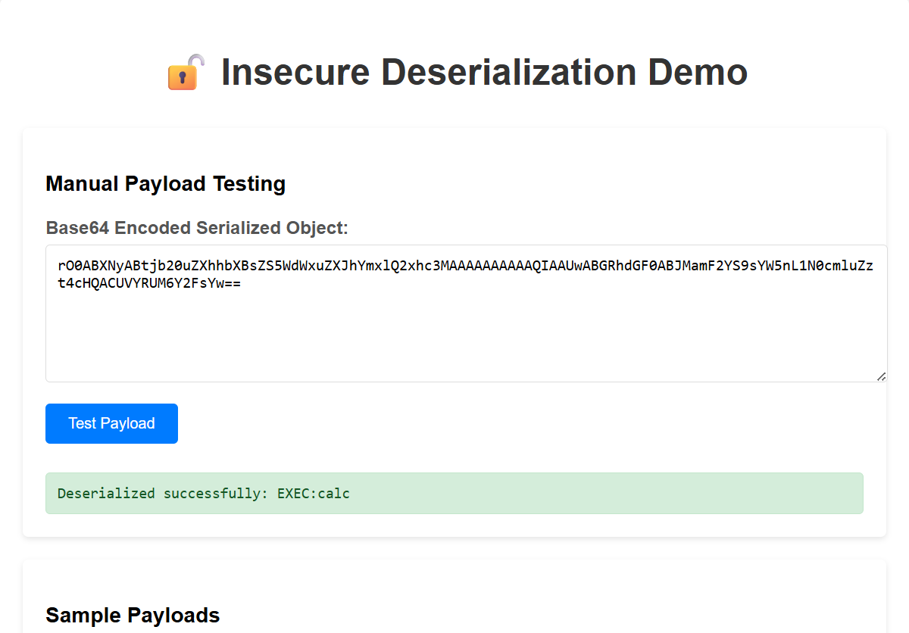

# Insecure Deserialization Vulnerability Demo

This project demonstrates a critical security vulnerability in Java applications: **Insecure Deserialization**. This vulnerability allows attackers to execute arbitrary code on the server by sending specially crafted serialized objects.

## ⚠️ WARNING

**This is a demonstration application with intentionally vulnerable code.**
- Only run this in a controlled, isolated environment
- Never deploy this code to production
- The application contains code that can execute arbitrary commands
- Use only for educational and testing purposes

## What is Insecure Deserialization?

Insecure deserialization occurs when an application deserializes untrusted data without proper validation. In Java, this can lead to:

1. **Remote Code Execution (RCE)** - Attackers can execute arbitrary commands on the server
2. **Privilege Escalation** - Gain elevated permissions
3. **Denial of Service (DoS)** - Crash the application
4. **Data Tampering** - Modify application state

## How the Vulnerability Works

### The Vulnerable Code

The application contains a `VulnerableClass` that implements `Serializable`:

```java
public class VulnerableClass implements Serializable {
    private String data;
    
    private void readObject(java.io.ObjectInputStream in) throws IOException, ClassNotFoundException {
        in.defaultReadObject();
        
        if (data != null && data.startsWith("EXEC:")) {
            String command = data.substring(5);
            Runtime.getRuntime().exec(command); 
        }
    }
}
```

### The Problem

1. The `readObject()` method is called automatically during deserialization
2. It checks if the data starts with "EXEC:" and executes the rest as a command
3. No validation is performed on the input
4. The application deserializes any object sent to it

### The Exploit

An attacker can:
1. Create a `VulnerableClass` instance with data like "EXEC:calc"
2. Serialize it to bytes
3. Base64 encode the bytes
4. Send it to the `/api/deserialize` endpoint
5. The server deserializes it and executes the command

## Running the Demo

### Prerequisites

- Java 11 or higher
- Maven 3.6 or higher

### Building and Running

```bash
# Build the project
mvn clean compile

# Run the Spring Boot application
mvn spring-boot:run
```

The application will start on `http://localhost:8080`

### Using the Frontend

1. Open `http://localhost:8080` in your browser
2. Test with safe payloads first
3. Try the exploit demonstration (be careful!)

## 💽 Application Screenshot



---

## Example Exploit

Here's how an attacker could exploit this vulnerability:

```java
// Create malicious object
VulnerableClass exploit = new VulnerableClass("EXEC:calc");

// Serialize it
ByteArrayOutputStream bos = new ByteArrayOutputStream();
ObjectOutputStream oos = new ObjectOutputStream(bos);
oos.writeObject(exploit);
oos.close();

// Base64 encode
String payload = Base64.getEncoder().encodeToString(bos.toByteArray());

// Send to vulnerable endpoint
// POST /api/deserialize with payload as body
```

## Real-World Impact

This vulnerability can be exploited in various scenarios:

1. **Web Applications** - User input is deserialized without validation
2. **RPC/Remoting** - Remote method calls with serialized parameters
3. **Caching Systems** - Deserializing cached objects
4. **Message Queues** - Processing serialized messages
5. **Session Storage** - Deserializing session data

## How to Fix Insecure Deserialization

### 1. Avoid Java Serialization

**Best Practice**: Don't use Java's built-in serialization for untrusted data.

```java
// Instead of ObjectInputStream, use safer alternatives
// JSON, XML, Protocol Buffers, etc.
```

### 2. Implement Whitelisting

```java
public class SecureDeserializer {
    private static final Set<String> ALLOWED_CLASSES = Set.of(
        "com.example.SafeClass",
        "java.util.ArrayList"
    );
    
    public Object deserialize(byte[] data) throws Exception {
        try (ObjectInputStream ois = new ObjectInputStream(new ByteArrayInputStream(data))) {
            // Override resolveClass to check allowed classes
            ObjectInputStream secureOis = new ObjectInputStream(new ByteArrayInputStream(data)) {
                @Override
                protected Class<?> resolveClass(ObjectStreamClass desc) throws IOException, ClassNotFoundException {
                    String className = desc.getName();
                    if (!ALLOWED_CLASSES.contains(className)) {
                        throw new SecurityException("Class not allowed: " + className);
                    }
                    return super.resolveClass(desc);
                }
            };
            return secureOis.readObject();
        }
    }
}
```

### 3. Use Custom Serialization

```java
public class SafeDataTransfer {
    private String data;
    
    // Use JSON instead of Java serialization
    public String toJson() {
        return new ObjectMapper().writeValueAsString(this);
    }
    
    public static SafeDataTransfer fromJson(String json) {
        return new ObjectMapper().readValue(json, SafeDataTransfer.class);
    }
}
```

### 4. Input Validation

```java
public ResponseEntity<String> deserializeObject(@RequestBody String base64Data) {
    // Validate input size
    if (base64Data.length() > 10000) {
        return ResponseEntity.badRequest().body("Payload too large");
    }
    
    // Validate base64 format
    if (!base64Data.matches("^[A-Za-z0-9+/]*={0,2}$")) {
        return ResponseEntity.badRequest().body("Invalid base64 format");
    }
    
    // Additional validation...
}
```

### 5. Use Security Managers

```java
// Enable security manager
System.setSecurityManager(new SecurityManager());

// Configure security policies
// -java.security.policy=security.policy
```

## Security Headers and Configuration

Add security headers to prevent other attacks:

```java
@Configuration
public class SecurityConfig {
    @Bean
    public SecurityFilterChain filterChain(HttpSecurity http) throws Exception {
        http
            .headers()
                .frameOptions().deny()
                .contentTypeOptions()
                .and()
                .httpStrictTransportSecurity()
            .and()
            .csrf().disable(); // For demo purposes only
        return http.build();
    }
}
```

## Testing for Vulnerabilities

### Manual Testing

1. Create serialized objects with different payloads
2. Test with malicious gadgets (Commons-Collections, etc.)
3. Use tools like ysoserial to generate payloads

### Automated Testing

```java
@Test
public void testDeserializationVulnerability() {
    // Test with known malicious payloads
    String maliciousPayload = "rO0ABXNyABFqYXZhLnV0aWwuSGFzaE1hcAUH2sHDFmDRAwACRgAKbG9hZEZhY3RvckkACXRocmVzaG9sZHhwP0AAAAAAAAB3CAAAAA==";
    
    // This should be rejected or handled safely
    ResponseEntity<String> response = restTemplate.postForEntity(
        "/api/deserialize", 
        maliciousPayload, 
        String.class
    );
    
    // Verify the response is safe
    assertThat(response.getStatusCode()).isNotEqualTo(HttpStatus.OK);
}
```


## Disclaimer

This project is for educational purposes only. The authors are not responsible for any misuse of this code. Always follow security best practices in production environments. 
